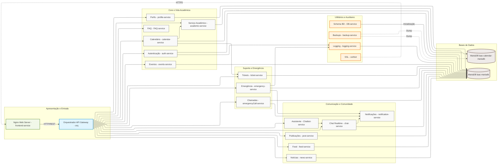
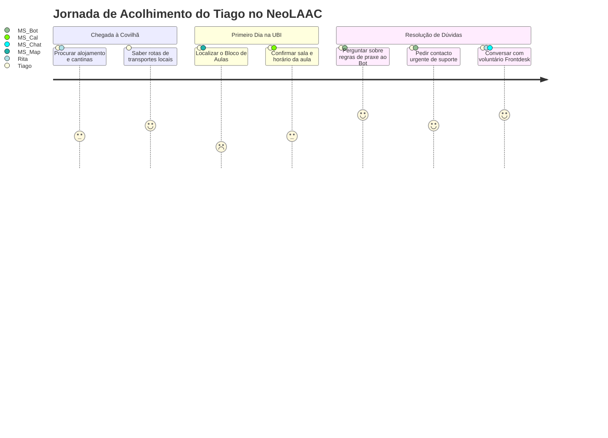
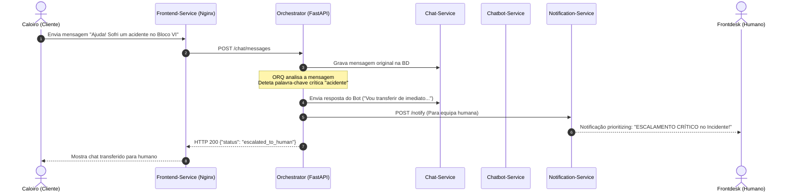
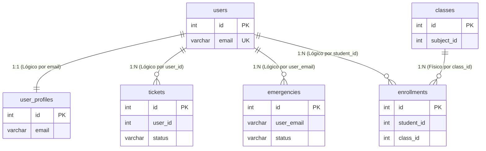
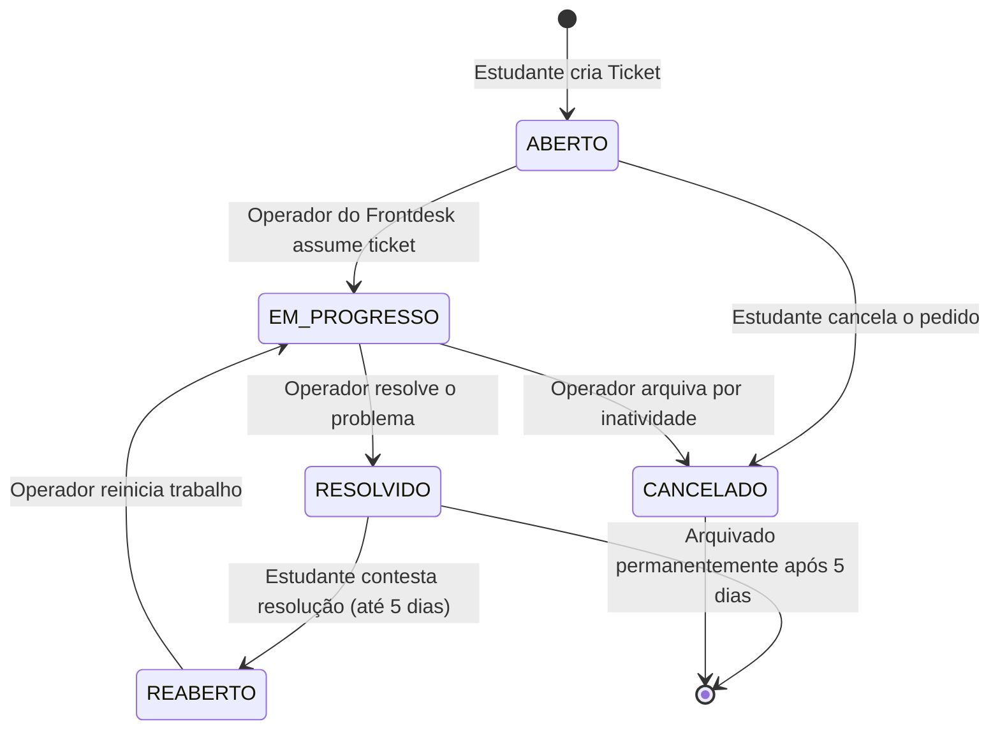
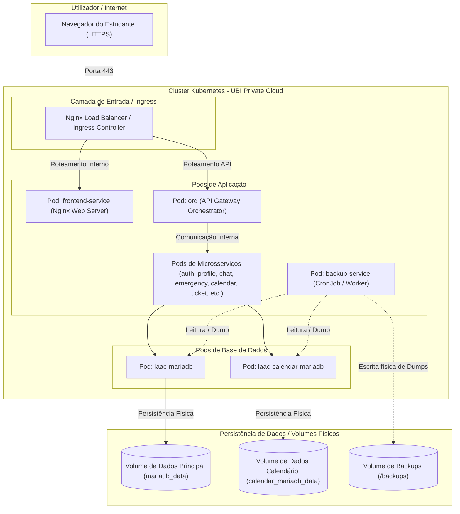

# 🎓 Linha de Apoio ao Caloiro (NeoLAAC)
## Documento de Levantamento de Requisitos (Funcionais e Não Funcionais)

Este documento descreve detalhadamente os requisitos funcionais e não funcionais do ecossistema digital **NeoLAAC** (Linha de Apoio ao Caloiro), concebido especificamente para apoiar a transição e integração dos novos estudantes da Universidade da Beira Interior (UBI).

---

## 👥 1. Atores do Sistema

Os utilizadores e papéis definidos no ecossistema são os seguintes:

| Ator | Descrição |
| :--- | :--- |
| **Estudante / Caloiro** | Utilizador que consulta informações académicas, mapas, transportes, interage no feed social e utiliza o canal de chat/emergência. |
| **Docente** | Utilizador responsável por partilhar informações e interagir academicamente com os alunos. |
| **Staff LAAC - Frontdesk** | Membros da equipa de apoio humano em tempo real. Respondem a incidentes e tickets escalados pelo chatbot. |
| **Staff LAAC - Devs / Testers** | Administradores de sistema e técnicos que efetuam alterações de desenvolvimento, testes e monitorizam os logs de auditoria. |
| **Staff LAAC - Marketing** | Focados na promoção de canais de comunicação, gestão de parcerias e divulgação. |
| **Organizações Académicas** | Núcleos de estudantes ou associações que gerem os seus próprios eventos e comunicados no espaço "Núcleo". |
| **Parceiros locais** | Entidades comerciais ou institucionais externas que fornecem descontos e benefícios aos estudantes. |

---

## 🏗️ 2. Mapeamento de Microsserviços e Componentes

O sistema é construído sobre uma arquitetura de microsserviços autónomos orquestrados:

*   **`frontend`**: Interface web responsiva em Nginx.
*   **`orq`**: API Orchestrator (Gateway único de comunicação externa).
*   **`auth-service` / `profile-service`**: Identidade, registo, login, perfis e permissões.
*   **`map-service`**: Integração do mapa do campus, geolocalização e rotas.
*   **`faq-service` / `chatbot-service`**: Perguntas frequentes e triagem automática inteligente.
*   **`chat-service` / `ticket-service` / `notification-service`**: Comunicação em tempo real, suporte humano e envio de alertas.
*   **`emergency-service` / `emergencyCall-service`**: Botão de pânico e requisição de chamadas de emergência.
*   **`academic-service` / `calendar-service`**: Cursos, disciplinas, horários, aulas e calendário de semestres.
*   **`post-service` / `feed-service` / `events-service` / `news-service`**: Funcionalidades de comunidade, posts, likes, comentários, notícias e eventos.
*   **`backup-service` / `logging-service`**: Segurança dos dados, auditoria centralizada e recuperação.

---

## 📋 3. Requisitos Funcionais (RF)

Os requisitos funcionais detalham os comportamentos, ações e capacidades que a plataforma NeoLAAC disponibiliza aos seus utilizadores.

### 🔐 3.1. Gestão de Identidade e Perfis
| ID | Requisito Funcional | Descrição | Componente Responsável |
| :--- | :--- | :--- | :--- |
| **RF01** | **Registo de Utilizadores** | O sistema deve permitir que novos utilizadores criem conta com o seu e-mail (institucional), palavra-passe e nome completo. | `auth-service` |
| **RF02** | **Autenticação Segura** | O sistema deve autenticar utilizadores e gerar tokens JWT seguros para controlo de sessão. | `auth-service` |
| **RF03** | **Perfis Dinâmicos** | O sistema deve suportar diferentes tipos de perfil baseados no cargo (Estudantes, Docentes, Administradores, Staff LAAC, etc.). | `profile-service` |
| **RF04** | **Atualização de Perfil** | O utilizador deve poder atualizar os seus dados pessoais e carregar fotos de perfil (/profiles/upload). | `profile-service` |
| **RF05** | **Gestão de Roles e Permissões** | O sistema deve permitir a criação e modificação dinâmica de papéis e regras de acesso de forma administrativa. | `auth-service` |
| **RF06** | **Sistema de Seguidores (Follow)** | O utilizador deve poder seguir outros perfis académicos e ver quem está a seguir. | `profile-service` |

### 🗺️ 3.2. Orientação, Infraestrutura e Mapas
| ID | Requisito Funcional | Descrição | Componente Responsável |
| :--- | :--- | :--- | :--- |
| **RF07** | **Visualização de Localizações** | O sistema deve disponibilizar um mapa digital interativo com localizações de blocos, pisos e salas da UBI através de dados espaciais (GeoJSON). | `map-service` |
| **RF08** | **Cálculo de Rotas Campus** | O sistema deve calcular uma rota pedonal a partir da localização GPS atual até uma sala/destino específico, permitindo prever a rota consoante uma hora. | `map-service` |
| **RF09** | **Horários e Rotas de Transportes** | O sistema deve catalogar e mostrar horários, rotas e preços atualizados dos transportes públicos locais da Covilhã. | `map-service` / `feed-service` |

### 🚨 3.3. Suporte Híbrido, Emergências e Tickets
| ID | Requisito Funcional | Descrição | Componente Responsável |
| :--- | :--- | :--- | :--- |
| **RF10** | **Base de FAQs** | O sistema deve expor uma secção de perguntas e respostas frequentes para consulta rápida. | `faq-service` |
| **RF11** | **Atendimento por Chatbot** | O utilizador deve poder interagir com um assistente virtual ("Mentor") para esclarecer dúvidas simples da FAQ em linguagem natural. | `chatbot-service` |
| **RF12** | **Triage Híbrida e Escalamento** | O sistema de chat deve monitorizar a conversa. Detetando palavras-chave críticas de emergência (ex: "polícia", "médico", "agressão", "fogo", "urgente") ou quando o chatbot não entende a pergunta, o atendimento deve ser escalado de imediato para a equipa humana de Frontdesk. | `orq` / `chat-service` |
| **RF13** | **Notificações de Suporte** | O sistema deve disparar alertas push prioritários para a equipa Frontdesk quando um incidente for escalado pelo chatbot. | `notification-service` |
| **RF14** | **Histórico de Conversas** | O sistema deve persistir de forma ordenada as mensagens do chat/incidente para consulta do aluno e do operador. | `chat-service` |
| **RF15** | **Chamada de Emergência Directa** | O utilizador deve poder fazer um pedido de chamada rápida em caso de situação grave. | `emergencyCall-service` |
| **RF16** | **Botão de Pânico / Alertas** | O sistema deve emitir alertas prioritários de emergência no ecossistema e registar o histórico dos eventos urgentes. | `emergency-service` |
| **RF17** | **Gestão de Tickets de Suporte** | O sistema deve catalogar incidentes como "Tickets", permitindo atualizar o seu estado (aberto, em progresso, resolvido), atribuir a equipas específicas e extrair métricas de suporte. | `ticket-service` |

### 📅 3.4. Vida Académica e Logística
| ID | Requisito Funcional | Descrição | Componente Responsável |
| :--- | :--- | :--- | :--- |
| **RF18** | **Listagem de Cursos e Disciplinas** | O sistema deve catalogar os cursos da UBI por ciclos de estudos, bem como as respetivas unidades curriculares. | `academic-service` |
| **RF19** | **Horários e Aulas** | O sistema deve permitir consultar as aulas planeadas (dia da semana, hora de início/fim, sala) para as disciplinas inscritas. | `calendar-service` |
| **RF20** | **Calendário Académico Geral** | O sistema deve disponibilizar as datas de início/fim de semestre e épocas de avaliação consoante o ano letivo. | `calendar-service` |
| **RF21** | **Reporte de Erros de Horário** | Estudantes e docentes devem poder reportar erros nos horários escolares, criando tickets específicos. | `calendar-service` / `ticket-service` |
| **RF22** | **Inscrições de Alunos** | O sistema deve gerir a inscrição ativa de estudantes em cursos e disciplinas específicos por semestre. | `academic-service` / `calendar-service` |

### 📣 3.5. Social, Comunidade e Divulgação
| ID | Requisito Funcional | Descrição | Componente Responsável |
| :--- | :--- | :--- | :--- |
| **RF23** | **Criação de Posts (Feed)** | Utilizadores e Núcleos devem poder publicar mensagens de texto, imagens e vídeos. | `post-service` |
| **RF24** | **Interação em Publicações** | O sistema deve permitir colocar reações (likes) e efetuar comentários nas publicações da comunidade. | `post-service` |
| **RF25** | **Feed Integrado e Notícias** | O sistema deve disponibilizar um feed contendo avisos institucionais da UBI, novidades gerais e posts das organizações. | `feed-service` / `news-service` |
| **RF26** | **Gestão de Eventos Sociais** | O sistema deve gerir eventos da comunidade universitária (ex: churrascos, conferências, desporto), registando localizações e organizadores. | `events-service` |
| **RF27** | **Benefícios e Parceiros Locais** | O sistema deve listar descontos e vantagens para estudantes em parceiros comerciais verificados locais. | `events-service` / `feed-service` |
| **RF28** | **Guias de Acolhimento e Sobrevivência** | O sistema deve alojar guias de praxe protegidos, códigos académicos, estatutos e conselhos práticos (alojamento, alimentação, finanças). | `feed-service` / `profile-service` |

### ⚙️ 3.6. Auditoria e Salvaguarda
| ID | Requisito Funcional | Descrição | Componente Responsável |
| :--- | :--- | :--- | :--- |
| **RF29** | **Visualização de Logs** | Os administradores de sistema devem poder consultar logs históricos consolidados de atividades dos microsserviços. | `logging-service` |
| **RF30** | **Backup Automatizado** | O sistema deve permitir a cópia de segurança completa das bases de dados em intervalos definidos, exportando para o volume de backups. | `backup-service` |

---

## 🔒 4. Requisitos Não Funcionais (RNF)

Os requisitos não funcionais determinam as restrições de qualidade, fiabilidade, segurança e padrões tecnológicos exigidos para que o sistema funcione de forma robusta e otimizada.



### 🛡️ 4.1. Segurança e Privacidade
*   **RNF01 (Criptografia de Credenciais):** As credenciais de acesso (palavras-passe) dos utilizadores devem ser encriptadas na base de dados utilizando hashes de via única seguros (ex: `bcrypt` ou similar).
*   **RNF02 (Segurança de Rede e Isolamento):** Apenas as portas do `frontend` (porta 8080/80) e as portas do orquestrador (quando aplicável) devem ser acessíveis de fora. Todos os microsserviços de apoio (bases de dados, auth, posts) devem comunicar estritamente através da rede interna do contentor (`host.docker.internal` ou rede de pods), sem exposição pública de portas.
*   **RNF03 (Controlo de Acesso Baseado em Papéis - RBAC):** Endpoints administrativos e confidenciais (ex: alteração de calendário, encerramento de alertas, gestão de logs) devem exigir validação do token JWT com a respetiva flag de permissão.
*   **RNF04 (Controlo de Acesso a Ficheiros):** Os ficheiros guardados no servidor devem ter mecanismos de restrição de acesso definidos em base de dados (ex: "public", "private", "academic-only") para salvaguardar regulamentos da UBI.
*   **RNF04a (Direito ao Esquecimento - RGPD):** O sistema deve disponibilizar um mecanismo para eliminação permanente da conta de utilizador, removendo dados pessoais identificáveis (perfis) e anonimizando o histórico de tickets e mensagens de chat (ex: substituindo dados pessoais por "Utilizador Eliminado").
*   **RNF04b (Consentimento Explícito - RGPD):** O utilizador deve dar consentimento explícito no registo para o tratamento dos seus dados de perfil, localização em tempo real e recolha de logs operacionais.
*   **RNF04c (Políticas de Retenção de Dados - RGPD):**
    *   Logs de atividades de auditoria: Retenção máxima de 90 dias.
    *   Conversas de chat e tickets resolvidos: Retenção máxima de 1 ano letivo, após o qual os dados pessoais devem ser expurgados ou completamente anonimizados para fins estatísticos.
    *   Rastreamento GPS: A geolocalização do utilizador para cálculo de rotas pedonais só deve ser processada em memória RAM durante o cálculo ativo, sendo estritamente proibido o seu armazenamento persistente em disco.

### ⚡ 4.2. Desempenho e Escalabilidade
*   **RNF05 (Tempo de Resposta):** O Gateway Orquestrador deve processar e devolver respostas aos pedidos HTTP normais de leitura em menos de 200 milissegundos.
*   **RNF06 (Concorrência do Chat):** O microsserviço de chat em tempo real deve suportar a troca de mensagens com atualizações dinâmicas, mantendo um atraso de entrega de mensagens (latência do chat) inferior a 1 segundo.
*   **RNF07 (Contentorização e Orquestração):** Todos os componentes do ecossistema devem ser empacotados como imagens Docker, permitindo escalamento elástico horizontal em Kubernetes.
*   **RNF08 (Gargalo de Base de Dados):** O sistema deve implementar bases de dados MariaDB independentes (`mariadb` principal e `calendar-mariadb` secundária) para isolar o tráfego pesado de consulta de calendários escolares e evitar degradação de desempenho no acesso a perfis e mensagens.

### 🛡️ 4.3. Fiabilidade, Resiliência e Disponibilidade
*   **RNF09 (Mecanismo de Fallback de Emergência / Autotriage):** Em caso de falha ou timeout de resposta do `chatbot-service`, o Orquestrador (`orq`) deve detetar a exceção e forçar automaticamente o escalamento imediato do chat para a equipa humana de Frontdesk, respondendo ao utilizador com uma mensagem de fallback explicativa.
*   **RNF10 (Monitorização e Health Checks):** Todos os microsserviços do ecossistema devem expor uma rota `/health` que testa a conectividade com as suas dependências (bases de dados, serviços parceiros). O Kubernetes ou o Docker Compose deve usar estes endpoints para reiniciar instâncias degradadas.
*   **RNF11 (Políticas de Backups):** O serviço de backups deve gerar cópias diárias de segurança consistentes e compactadas na diretoria `/backups`, permitindo uma perda máxima de dados de 24 horas (RPO) e um tempo de recuperação total de dados (RTO) inferior a 2 horas.

### 💻 4.4. Usabilidade e Compatibilidade
*   **RNF12 (Compatibilidade de Navegadores):** A interface web (frontend) deve ser 100% responsiva (mobile-first), garantindo compatibilidade estética e operacional com os principais navegadores modernos (Safari, Chrome, Edge, Firefox).
*   **RNF13 (Internacionalização e Idioma):** A interface de utilizador do NeoLAAC deve ter suporte nativo em Português (PT-PT), considerando que é dirigida maioritariamente aos estudantes que se integram na UBI e na Covilhã.
*   **RNF13a (Acessibilidade Digital - WCAG 2.1 AA):** O frontend deve estar em conformidade com as diretrizes WCAG 2.1 nível AA, garantindo acessibilidade a utilizadores com necessidades especiais.
*   **RNF13b (Leitores de Ecrã):** Todos os elementos visuais, imagens e botões de interface devem conter descrições semânticas adequadas (atributos `aria-label`, `alt` e tags HTML semânticas como `<main>`, `<nav>`, `<button>`) para permitir a navegação correta por leitores de ecrã (como NVDA ou JAWS).
*   **RNF13c (Navegação por Teclado):** Toda a navegação no portal deve ser possível exclusivamente através do teclado (usando a tecla Tab para focar elementos com indicação visual clara de foco) para acomodar utilizadores com limitações motoras.
*   **RNF13d (Contraste de Cores):** O rácio de contraste entre a cor de texto e o fundo deve respeitar a norma mínima de 4.5:1 para texto normal e 3:1 para texto grande.

---

## 🔄 5. Fluxo de Triagem e Escalamento (Chatbot ➔ Humano)

O seguinte fluxo lógico garante que o estudante nunca fica sem suporte imediato, transitando dinamicamente de assistência robótica para auxílio físico:

```
[Estudante envia Mensagem]
          │
          ▼
[Mensagem contém palavras-chave de perigo?] ──(Sim)──► [Escala p/ Humano (Prioritário)] ──► [Notifica Frontdesk]
          │                                                                                       │
         (Não)                                                                                    │
          │                                                                                       ▼
          ▼                                                                            [Chat Humano em Tempo Real]
[Bot responde de forma coerente?]
          │
      ┌───┴───┐
    (Sim)    (Não/Erro/Timeout)
      │       │
      ▼       ▼
[Conversa]  [Bot informa utilizador que vai transferir]
[Mantém Bot]  │
              ▼
            [Escala p/ Humano (Prioritário)] ──► [Notifica Frontdesk]
```

---

## 👥 6. Engenharia de Requisitos e Produto

### 👤 6.1. Personas do Sistema

#### Persona 1: Tiago Silva (O Caloiro)
*   **Perfil**: 18 anos, caloiro de Engenharia Informática, vindo de Portimão para a Covilhã.
*   **Necessidades**: Precisa de saber onde são as aulas (Bloco VI da UBI), como funcionam os transportes urbanos (Covibus) e como aceder à cantina.
*   **Frustrações**: Sente ansiedade espacial, perde-se facilmente e tem receio de não conseguir conciliar os horários das aulas com a praxe.

#### Persona 2: Dra. Maria Antunes (A Docente)
*   **Perfil**: 45 anos, docente e coordenadora de departamento.
*   **Necessidades**: Quer divulgar horários atualizados de apoio pedagógico e enviar avisos urgentes sobre alterações de salas de aula aos seus alunos.
*   **Frustrações**: Sente que os e-mails institucionais são ignorados e prefere uma comunicação integrada e instantânea.

#### Persona 3: Rita Gomes (Staff LAAC - Frontdesk)
*   **Perfil**: 21 anos, estudante do 3.º ano de Psicologia e voluntária do apoio ao caloiro.
*   **Necessidades**: Quer um painel consolidado para gerir as conversas escaladas pelo bot e responder com eficácia a incidentes prioritários.
*   **Frustrações**: Fadiga ao responder à mesma pergunta fútil dezenas de vezes. Precisa que o chatbot filtre as dúvidas comuns.

---

### 🗺️ 6.2. Jornada do Usuário (User Journey)

**Cenário**: *O primeiro dia do Tiago Silva na UBI*



---

### 📦 6.3. Épicos e Histórias de Usuário (User Stories)

#### [ÉPICO 01] - Orientação Espacial e Académica
*   **US01 - Visualização de Horários**: Como **Estudante**, quero **visualizar o meu horário escolar sincronizado** para que possa planear a minha presença nas aulas sem conflitos.
*   **US02 - Rotas de Acesso**: Como **Estudante**, quero **obter uma rota passo a passo entre blocos e salas** para evitar atrasos e combater a ansiedade de me perder no campus.

#### [ÉPICO 02] - Suporte e Triage Híbrida
*   **US03 - Resolução Autónoma de Dúvidas**: Como **Estudante**, quero **colocar questões em linguagem natural ao chatbot** para obter respostas imediatas sem ter de esperar por atendimento humano.
*   **US04 - Escalamento de Emergência**: Como **Estudante**, quero **ser transferido automaticamente para um assistente humano** se o chatbot não souber responder ou se eu reportar uma situação crítica (ex: pânico, ferimento), para ter apoio prioritário.

---

### 🔑 6.4. Critérios de Aceite (Acceptance Criteria)

#### Exemplo: Critérios de Aceite para a US04 (Triage Híbrida)
*   **Cenário 1: Deteção de palavras-chave críticas**
    *   **Dado** que o utilizador está numa sessão ativa de chat com o Mentor Digital,
    *   **Quando** o utilizador digita uma mensagem contendo palavras como *"emergência"*, *"urgente"*, *"ferido"* ou *"ladrão"*,
    *   **Então** o sistema deve alterar o estado do incidente para `escalated_to_human`, enviar um alerta prioritário à equipa de Frontdesk via `notification-service` e responder ao aluno indicando que a equipa humana foi notificada.
*   **Cenário 2: Fallback por incompreensão do bot**
    *   **Dado** que o bot não compreende a pergunta e emite a sua resposta padrão de erro (*"não consegui compreender..."*),
    *   **Quando** isso acontece,
    *   **Então** o orquestrador deve registar o incidente na fila e notificar o Frontdesk, marcando o estado como `escalated_due_to_fallback`.

---

### 🛠️ 6.5. Casos de Uso (Use Cases)

```mermaid
usecaseDiagram
    actor Estudante
    actor Frontdesk
    actor Docente
    
    Estudante --> (Consultar Horário e Salas)
    Estudante --> (Traçar Rota Pedonal)
    Estudante --> (Conversar com Bot / Pedir Suporte)
    Estudante --> (Enviar Alerta de Emergência)
    
    (Conversar com Bot / Pedir Suporte) ..> (Escalar para Humano) : <<extend>>
    
    Frontdesk --> (Resolver Ticket de Suporte)
    Frontdesk --> (Atender Chat Escalado)
    
    Docente --> (Atualizar Horário de Apoio)
```

---

### 🗃️ 6.6. Product Backlog (Priorização MoSCoW)

*   **Must Have (Obrigatório)**:
    1.  Autenticação JWT e Perfis (`auth-service` / `profile-service`).
    2.  Chatbot de suporte básico e triage híbrida (`chatbot-service` / `orq` / `chat-service`).
    3.  Botão de emergência e alertas prioritários (`emergency-service`).
*   **Should Have (Recomendável)**:
    1.  Mapa do campus com rotas e localizações (`map-service`).
    2.  Calendário académico e aulas (`calendar-service`).
    3.  Painel de controlo de tickets para a equipa Frontdesk (`ticket-service`).
*   **Could Have (Poderia ter)**:
    1.  Feed social da comunidade e posts de núcleos (`feed-service` / `post-service`).
    2.  Descontos e guia de parceiros verificados (`events-service`).
*   **Won't Have (Não agora)**:
    1.  Videoconferência integrada direta na app (substituída por chat em tempo real e chamada telefónica standard).

---

## 🎨 7. Design e Interface (UI/UX)

### 📐 7.1. Wireframe e Mapa de Navegação (Sitemap)

```
[Navegação Principal do Frontend]
 ├── /login (Acesso e Registo)
 ├── /dashboard (Espaço Pessoal e Avisos do Caloiro)
 ├── /mapa (Mapa do campus, salas e rotas pedonais)
 ├── /chat (Falar com o Mentor / Botão de Pânico)
 ├── /horarios (Calendário académico e aulas)
 └── /comunidade (Feed de publicações e eventos de parceiros)
```

### 🎨 7.2. Design System do NeoLAAC

*   **Paleta de Cores**:
    *   `Primary (UBI Blue)`: `#005691` (Confiança, Institucional)
    *   `Secondary (Cobalt)`: `#002D62`
    *   `Success (Green)`: `#2E7D32` (Para alertas de rotas corretas/aulas online)
    *   `Danger / Alert (Red)`: `#D32F2F` (Exclusivo para o Botão de Emergência)
    *   `Neutral Light (Bg)`: `#F5F7FA`
    *   `Neutral Dark (Text)`: `#1C1E21`
*   **Tipografia**:
    *   Fonte principal: `Inter` (Sans-Serif para interfaces limpas e legíveis)
    *   Fonte de destaque: `Outfit` (Para cabeçalhos e títulos dinâmicos)
*   **Componentes Reutilizáveis**:
    *   `ActionButton`: Botão com cantos arredondados (`border-radius: 8px`), sombra suave e transição de hover (`transition: 0.2s`).
    *   `ChatBubble`: Mensagens recebidas alinhadas à esquerda em cinza claro, mensagens enviadas à direita em azul institucional.

---

## 📐 8. Modelagem e Arquitetura Detalhada

### 🔄 8.1. Diagrama de Sequência (Triagem e Escalamento Híbrido)

Este diagrama representa a sequência de chamadas HTTP internas desencadeadas quando um caloiro envia uma mensagem crítica no chat.



---

### 📝 8.2. Contratos de API (Swagger / OpenAPI Exemplo)

Especificação do endpoint de criação de rotas do `map-service`:

```yaml
openapi: 3.0.3
info:
  title: NeoLAAC Map Service API
  version: 1.0.0
paths:
  /route:
    get:
      summary: Calcula a rota pedonal para um bloco/sala
      parameters:
        - name: start_lat
          in: query
          required: true
          schema:
            type: number
            format: float
        - name: start_lng
          in: query
          required: true
          schema:
            type: number
            format: float
        - name: dest_id
          in: query
          required: true
          schema:
            type: string
        - name: time
          in: query
          required: false
          schema:
            type: string
            format: time
      responses:
        '200':
          description: Rota calculada com sucesso
          content:
            application/json:
              schema:
                type: object
                properties:
                  distance_meters:
                    type: number
                  duration_seconds:
                    type: number
                  polyline_geojson:
                    type: string
        '400':
          description: Coordenadas inválidas ou sala destino inexistente
```

---

### 🗃️ 8.3. Diagrama de Entidade-Relacionamento (ERD) e Gestão Trans-Serviços

Como o NeoLAAC adota uma arquitetura de microsserviços com bases de dados separadas (`laac-mariadb` e `laac-calendar-mariadb`), as relações físicas tradicionais (Foreign Keys a nível de SGBD) são limitadas apenas ao interior de cada base de dados. As relações entre microsserviços distintos são geridas ao nível lógico/aplicacional pela orquestração do `orq` ou comunicação assíncrona por eventos.



*   **Identidade e Perfis (`auth` ➔ `profile`)**: O relacionamento é feito através do `email` do utilizador. As informações de login ficam na tabela `users` do serviço de autenticação, enquanto os dados adicionais de estudantes e núcleos residem em `user_profiles`, garantindo independência de domínio.
*   **Gestão de Suporte (`auth` ➔ `ticket` / `emergency`)**: Os incidentes e alertas não possuem restrições físicas com a tabela `users`. O orquestrador valida a existência do `user_id` ou `user_email` chamando o `auth-service` via API HTTP antes de permitir qualquer inserção de suporte.
*   **Camada Académica (`calendar-service` / `academic-service`)**: As inscrições de turmas (`enrollments`) e horários (`classes`) residem na base de dados `laac-calendar-mariadb`. A relação com o estudante é lógica (`student_id` correspondente ao `users.id`), resolvida por agregações no Orchestrator.

---

### 🔄 8.4. Diagrama de Estados (Ticket State Machine)

O ciclo de vida dos tickets de suporte prioritário é modelado de acordo com a seguinte máquina de estados, clarificando a transição de responsabilidade entre caloiro e operadores:



---

## 💻 9. Padrões de Desenvolvimento e Código

### 🏗️ 9.1. Padrões de Projeto (Design Patterns)
1.  **API Gateway / Orchestrator**: Toda a comunicação externa passa pelo `laac-orq`. Este unifica os endpoints e simplifica as chamadas do cliente, aplicando regras como segurança e auditoria centralizada.
2.  **Database-per-Service**: O microsserviço de calendário possui uma base de dados relacional isolada (`calendar-mariadb`) para proteger o tráfego dos horários de carga da base de dados principal.
3.  **Command / Factory Pattern**: Utilizado internamente nos microsserviços para gerir ações de criação de alertas consoante a severidade.

### ✍️ 9.2. Guia de Padrão de Commits (Conventional Commits)
Todas as alterações no repositório do NeoLAAC devem seguir o padrão:
*   `feat(scope)`: Nova funcionalidade (ex: `feat(chat): adiciona suporte a logs de escalamento`).
*   `fix(scope)`: Correção de um bug (ex: `fix(auth): corrige token expirado no cabeçalho`).
*   `chore(scope)`: Manutenções, builds, dockerfiles (ex: `chore(deps): atualiza sqlalchemy`).

### 🌿 9.3. Estratégia de Ramificação (Git Branching Strategy)
O desenvolvimento do NeoLAAC segue um modelo híbrido do **GitFlow**:
*   `main`: Ramo estável de produção. Protegido contra commits diretos. Merges permitidos apenas a partir de `develop` (via PRs aprovados) e de ramos de `hotfix/*`.
*   `develop`: Ramo principal de integração de desenvolvimento. Todas as novas features são consolidadas aqui.
*   `feature/*`: Ramos de desenvolvimento de funcionalidades novas (ex: `feature/triage-hybrid`), criadas a partir de `develop` e fundidas de volta após aprovação de PR e testes verdes.
*   `bugfix/*`: Ramos temporários criados a partir de `develop` para correções em desenvolvimento.
*   `hotfix/*`: Ramos de correção urgente gerados diretamente a partir de `main` e fundidos em `main` e `develop` simultaneamente.

---

## 🧪 10. Qualidade e Testes (QA)

### 📋 10.1. Casos de Teste (Test Cases)

#### **CT-01: Login Efetuado com Sucesso**
*   **Ação**: Enviar um POST `/auth/login` com e-mail institucional e palavra-passe válidos.
*   **Resultado Esperado**: Retorno de um HTTP 200 contendo o token JWT e a flag do perfil do utilizador.

#### **CT-02: Escalamento Automático do Chat**
*   **Ação**: Enviar uma mensagem contendo *"emergência"* no chat.
*   **Resultado Esperado**: O orquestrador deve intercetar a palavra, gravar a mensagem e devolver o estado `escalated_to_human`, disparando o request para o `notification-service`.

---

### 📊 10.2. Cobertura de Testes Unitários por Microsserviço

Para garantir a robustez de todas as funcionalidades de negócio, foi criada uma suite abrangente de testes unitários que cobre as principais rotas e lógica interna dos microsserviços centrais:

| Microsserviço | Testes | Ficheiro de Teste | Lógica Validada |
| :--- | :---: | :--- | :--- |
| **`orq`** | 25 | [orq/tests/test_orq.py](file:///c:/Users/koeni/Documents/git/LAAC/orq/tests/test_orq.py) | Orquestração de rotas, triagem híbrida (escalamento do bot por palavras-chave críticas e fallbacks de erro). |
| **`auth-service`** | 12 | [auth-service/tests/test_auth.py](file:///c:/Users/koeni/Documents/git/LAAC/auth-service/tests/test_auth.py) | Registo de utilizadores únicos, autenticação JWT, encriptação de passes, validação de tokens e gestão RBAC de papéis. |
| **`profile-service`** | 11 | [profile-service/tests/test_profile.py](file:///c:/Users/koeni/Documents/git/LAAC/profile-service/tests/test_profile.py) | Consulta e criação de perfis com valores por omissão, upload de avatar, seguidores (follow/unfollow). |
| **`emergency-service`** | 5 | [emergency-service/tests/test_emergency.py](file:///c:/Users/koeni/Documents/git/LAAC/emergency-service/tests/test_emergency.py) | Criação de alertas de emergência, registo histórico, e disparo de notificações à equipa humana de resposta. |
| **`ticket-service`** | 3 | [ticket-service/tests/test_main.py](file:///c:/Users/koeni/Documents/git/LAAC/ticket-service/tests/test_main.py) | Validação estrutural de novos tickets, criação de tickets prioritários e gravação em base de dados. |

---

### ⚙️ 10.3. Pipeline de Validação Híbrida (`pipeline.py`)

A pipeline de integração contínua (`pipeline.py`) executa automaticamente as suites de teste de cada microsserviço dentro dos respetivos containers Docker. Como algumas imagens leves de microsserviços não dispõem de frameworks adicionais como o `pytest`, a pipeline foi desenhada com um **mecanismo de fallback inteligente**:

1. Tenta executar a suite de testes utilizando `pytest`.
2. Caso o container não possua `pytest` (erro: *No module named pytest*), a pipeline comuta automaticamente para o utilitário nativo de testes do Python:
   ```bash
   python -m unittest discover -s tests
   ```
Desta forma, garantimos uma validação de regressão 100% estrita e com zero dependências externas em produção.

---

### 🧪 10.4. Exemplo de Script de Teste (Mocking e Triage Híbrida)

```python
# Ficheiro: orq/tests/test_orq.py
@patch("httpx.AsyncClient", new=MockAsyncClient)
def test_chat_messages_endpoint_flow():
    # 1. POST /chat/messages - normal message (bot answers)
    payload_normal = {"incident_id": 100, "sender_email": "caloiro@ubi.pt", "message": "Qual é a sala de POO?", "is_responder": False}
    res_normal = client.post("/chat/messages", json=payload_normal)
    assert res_normal.status_code == 200
    assert res_normal.json()["status"] == "resolved_by_bot"

    # 2. POST /chat/messages - message containing critical keyword (escalates to human)
    payload_critical = {"incident_id": 100, "sender_email": "caloiro@ubi.pt", "message": "Estou em pânico, tive um acidente!", "is_responder": False}
    res_critical = client.post("/chat/messages", json=payload_critical)
    assert res_critical.status_code == 200
    assert res_critical.json()["status"] == "escalated_to_human"
```

---

## 📅 11. Gestão do Projeto (Ágil)

*   **Sprints**: Ciclos de desenvolvimento quinzenais (Sprints de 2 semanas) com reuniões de Sprint Planning, Daily Sync (15 minutos) e Sprint Retrospective.
*   **Definição de Pronto (Definition of Done - DoD)**:
    *   Código escrito e validado pelo linter.
    *   Testes unitários associados criados e a passar com sucesso (cobertura mínima de 80%).
    *   Build Docker a ser efetuado com sucesso (passando no script `pipeline.py`).
    *   Documentação de novas APIs atualizada.
    *   Código revisto e aprovado por pelo menos um colega no Pull Request.

---

## 🚀 12. DevOps, Implantação e DevSecOps

### 🐳 12.0. Diagrama de Implantação (Deployment Diagram)

A implantação física do ecossistema NeoLAAC mapeia o encaminhamento de rede externa e o isolamento de persistência de dados no cluster Kubernetes:



---

### 📦 12.1. Contentores (Dockerfile Exemplo do Orquestrador)

```dockerfile
# Ficheiro: orq/Dockerfile
FROM python:3.11-slim

WORKDIR /app

RUN apt-get update && apt-get install -y --no-install-recommends \
    gcc \
    libmariadb-dev \
    && rm -rf /var/lib/apt/lists/*

COPY requirements.txt .
RUN pip install --no-cache-dir -r requirements.txt

COPY . .

EXPOSE 8000

CMD ["uvicorn", "main:app", "--host", "0.0.0.0", "--port", "8000"]
```

---

### ⚙️ 12.2. Pipeline de CI/CD (GitHub Actions Workflow Exemplo)

```yaml
# Ficheiro: .github/workflows/ci.yml
name: NeoLAAC Continuous Integration

on:
  push:
    branches: [ main, develop ]
  pull_request:
    branches: [ main ]

jobs:
  validate:
    runs-on: ubuntu-latest
    steps:
    - uses: actions/checkout@v3

    - name: Set up Python
      uses: actions/setup-python@v4
      with:
        python-version: '3.11'

    - name: Install dependencies
      run: |
        python -m pip install --upgrade pip
        pip install pytest httpx sqlalchemy pymysql

    - name: Run Pipeline Validation Script
      run: |
        python pipeline.py
```

### 🛡️ 12.3. Práticas DevSecOps
*   **Análise Estática de Segurança (SAST)**: Varredura periódica de código utilizando ferramentas como `Bandit` (para Python) para identificar vulnerabilidades conhecidas (injeções SQL, uso de secrets hardcoded).
*   **Isolamento de Secrets**: Configuração de credenciais de base de dados e tokens de terceiros estritamente via variáveis de ambiente configuradas em ficheiros `.env` protegidos, sem nunca comitar dados confidenciais no repositório Git.
*   **Monitorização Automática**: Utilização do microsserviço de logs centralizado (`logging-service`) para detetar atividades suspeitas de força bruta em `/auth/login` e reportar alertas imediatos.

